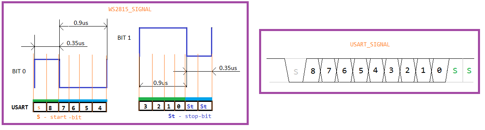

<h1 align="center"> STM32f03x + WS2815 + RS485</h1>

  

---

<h5 align="center">Этот проект написан с целью управления адрессной светодиодной лентой WS2815 при помощи STM32</h5>

> Проект находится в стадии наработки и оптимизации. Время от времени я буду добавлять сюда разные анимации а так же оптимизировать код.

## Как это работает:

Я использую 9-битный USART. В моем распоряжении есть 1 стартовый бит + 9 бит данных + 2 стоповых бита:

  

Для формирования одного бита достаточно будет иметь значение нацело делимое на 3. Исходя из протокола WS2815, `1` или `0` формируются таймингами (левая часть рисунка выше).
Как я подсчитал, мне достаточно 6 бит USART для формирования 1 бита, и как итог одновременно я могу отправлять сразу 2 бита `00` `01` `10` `11`.
> Если внимательно сопоставить оба рисунка то можна заметить что стартовый и стоповый бит противоположны и нужно инвертировать сигнал. Для этого иделально подойдет канал B RS485.

Теперь мне достаточно вывести 12 частей 24-итного цвета для каждого пикселя на светодиодной ленте.
Для вывода изображения я использую DMA и таймер. Скорость обновления изображения можно регулировать при помощи настроек таймера и USART.

## Особенности:

1. Для того чтоб упростить работу в проекте есть имитация delay_us() и delay_ms().
2. Из свободного доступа на форуме я реализовал у себя функцию рандомизации при помощи сенсора температуры и ADC. Для этого проекта - самой энтропии а так же рандомность вполне приемлемая. Но тут есть и свои недостатки.
3. Заголовки некоторых функций написанны так чтоб соответствовать библиотеке NeoPixel для arduino.
4. Имея на руках реализацию функций под arduino я взял готовые анимации из сайта <a href="https://www.tweaking4all.com/hardware/arduino/adruino-led-strip-effects/">Tweaking4All.com</a> и без особых проблем реализовал их в проекте.
5. Так же в этом проекте реализованы 2 анимации (которые изначально нужны были в проекте для турникета).
> Одна из них это перемещение обьекта вдоль ленты с плавным исчезновением. Задача заключалась в том чтоб максимально повысить FPS. И вместо того чтоб держать в памяти огромное колличество кадров состояния шага (до тех пор пока не сдвинемся к следующему пикселю) я использовал пересчет значениея цвета в определенный момент времени. Такие расчеты занимают больше времени но при этом использовать можна на много больше пикселей. Смысл в том чтоб сначала несколько раз показать плавное изменение одного положения обьекта на ленте а после этоо сместить его на пиксель дале. 

> Второй ефект - появление ранее известного колличества пикселей в случайных местах из случайной продолжительностью "жизни". Ефект использует функцию градиента одного цвета в другой имея лишь значение прогресса который может быть от 0 до 1 где 0 это стартовое значение цвета а 1 - конечное. Получилось довольно интересно. для его использования нужно запустить `FirstSetArray(-1);` и `SetArray(-1);` а после в вечном цикле вызывать `setSendBufferArray(-1, sColor, eColor);`

Обратите внимание что принимаю цвет я в формате RGB но в массив я применяю именно BRG формат для чего вызываю `uint32_t RGB_to_BRG(uint32_t color)`

## Использование:

Весь код кроме инициализации контроллера, функции вывода на ленту и рандом при помощи ADC очень просто перенести в ваш проект. Сам проект написан в среде Keil от STM32.
Как упоминалось ранее вам понадобится RS485. Сигнальный контакт адрессной ленты следует подключать к выходу B вашей микросхемы RS. Чтоб использовать анимацию вам нужно раскоментировать нужную функция в `main()`. Если вам нужна анимация движения обьекта с плавным исчезновением, вам следует раскоментировать код в обработчике перерывания и все что в `main()` закоментировать.

## версии:

* <a href="https://github.com/vlobunet/stm32f03x_ws2815_ledstrip/commit/4cde2e999db4d0058c29833d6b9ac030d352d90c">V0.0.1</a> первая загрузка и формирование проекта на GitHub. Тут уж ереализованы множество интересных анимаций. Реализован вывод буфера в ленту. Реализовано множество впомогательных "библиотечных" функций которые адаптивны и для arduino.

## Планы:

* Реализовать в проекте список анимаций из проекта WLED на си
* Реализовать переход между 3 функциями что нужно для работы.

## Участники проекта:

<a href="https://github.com/vlobunet">@vlobunet</a>

